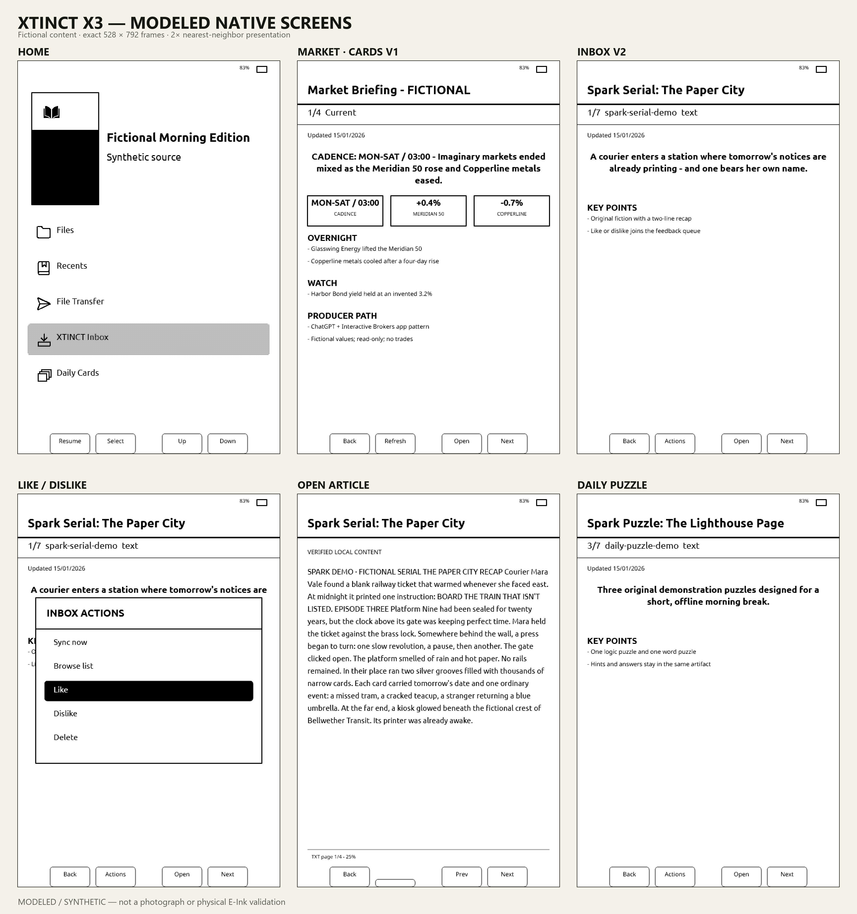
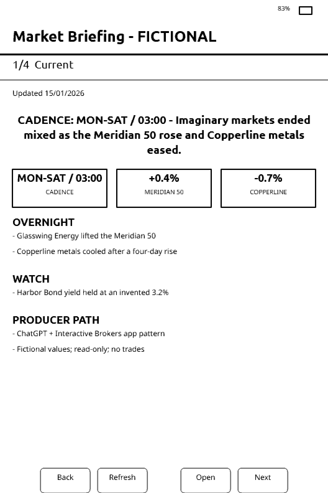
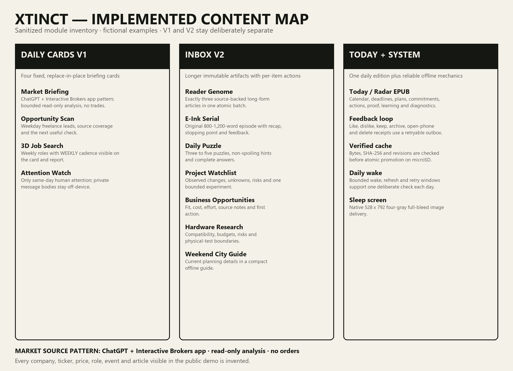
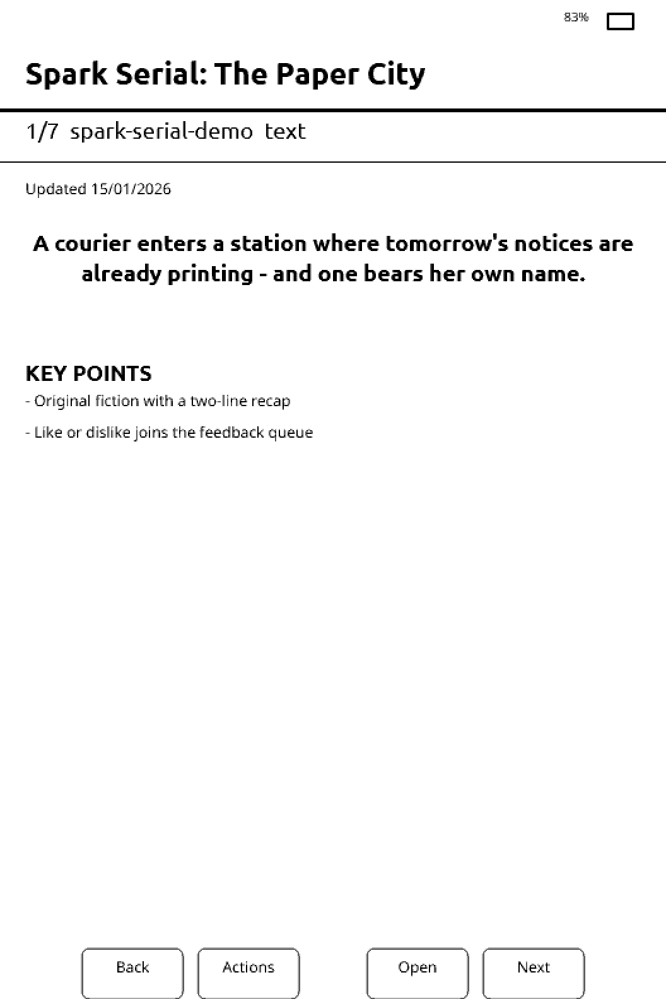
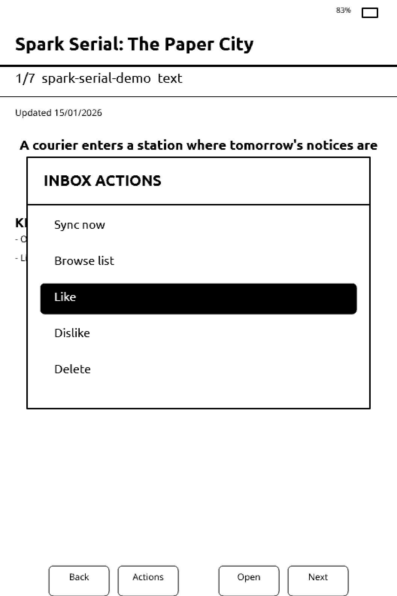
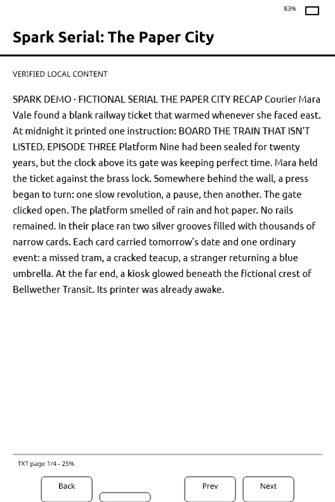
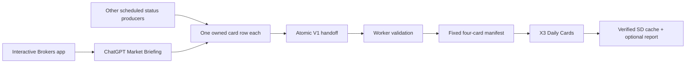
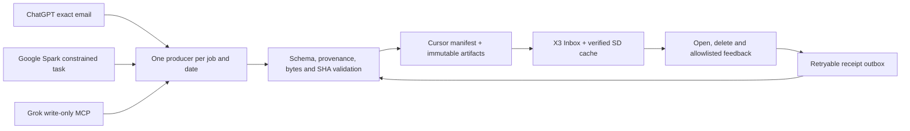

# XTINCT X3 Reference Stack

An open, reproducible reference implementation for turning an Xteink X3 into a once-a-day personal briefing reader. It extends the MIT-licensed CrossPoint Reader firmware with native Daily Cards V1, Inbox V2, a Today EPUB path, feedback receipts, cache-first recovery, scheduled wake handling, and a four-gray X3 sleep screen.

**Repository release 0.1.0-alpha.3.** This release advances to the exact
endpoint-free `1.6.2-xtinct.2` firmware image, hardens bounded Daily Cards V1
and Inbox V2 recovery, and makes a clean public checkout reproduce the pinned
dependency and source-provenance gates. It is still a physical-X3-pending
candidate, not a stable firmware declaration.

This repository is the companion to the [X3 Preview & QA Lab](https://github.com/RO11/x3-preview-qa-lab). The Preview Lab models and tests the experience on Windows. This repository contains the device-side source and, once every release gate passes, the exact installable X3 image built from that source.

> **Alpha software.** A passing simulator or QEMU run does not prove physical E-Ink waveforms, buttons, SD-card power-loss behavior, Wi-Fi/Bluetooth radio behavior, fragmented heap, watchdog timing, RTC wake, battery use, or recovery. Check the evidence table for the exact release before installing anything.

## What is included

- Complete XTINCT CrossPoint firmware source, based on upstream CrossPoint commit `4e619035`.
- The matching FreeInk source snapshot and XTINCT TLS patch.
- A sanitized D1/R2 Cloudflare Worker reference implementing the exact Cards
  V1, Inbox V2, artifact, tombstone, receipt and like/dislike contracts.
- A hash-pinned official CrossPoint v1.5.0 baseline used only by the preview
  emulator, clearly separated from the custom installable image.
- A checksum-bound installable `update.bin` on every firmware-bearing release.
- Matching dependency source, QEMU boot-set and QA-evidence archives.
- Daily Cards V1: exactly four small, glanceable cards with revision-aware downloads, checksums, cache-first rendering, visible refresh progress, catch-up state and bounded failure recovery.
- Inbox V2: cursor paging, immutable SHA-addressed artifacts, EPUB/text/BMP support, open/delete actions, like/dislike feedback, receipts and retryable outbox delivery.
- Today EPUB: a compact once-daily reading edition designed for offline use.
- Sleep-screen delivery: exact 528×792, uncompressed 4-bpp BMP using the X3 panel's native 0/85/170/255 palette.
- File Transfer hardening validates each actual long filename from the SD card;
  it never guesses a FAT short-name alias when deciding whether an upload may
  replace firmware or another protected file.
- Daily wake scheduling with explicit readiness diagnostics and catch-up windows.
- Local simulator contracts and offline ESP32-C3 QEMU boot validation.
- Synthetic fixtures and protocol documentation. No private email, content, Worker address, token, account ID, sheet ID, device serial, IP address or personal project data is included.

## What the Inbox actually looks like

These are direct native 528×792 modeled framebuffers, not browser crops or enlarged phone mockups. The overview uses 2× nearest-neighbor presentation so high-density displays do not soften or relocate the pixels. Click it for the full `3456 × 3688` file.

The screens are intentionally shown at useful width rather than squeezed side-by-side into a Markdown table.

### Fictional market card with source provenance

This screen makes the production source pattern explicit: ChatGPT can use the official Interactive Brokers app for read-only portfolio and market evidence, then publish a bounded V1 Market Briefing. To reproduce it, connect **Interactive Brokers** from ChatGPT's **Settings → Apps** through IBKR's own sign-in screen, keep the producer prompt analysis-only, remove account/order identifiers and raw connector output, then submit the completed brief through the owned V1 `market-briefing` handoff. See the [Interactive Brokers AI Hub](https://www.interactivebrokers.com/en/trading/ai-hub.php) and [OpenAI Apps guide](https://help.openai.com/en/articles/11487775-connectors-in-chatgpt). The public fixture itself does not connect to a brokerage account, contains no real holding or quote, and cannot place a trade.

### Implemented module map

### Inbox V2 preview

### Like / dislike feedback

### Opened text artifact

All visible material is synthetic: an original 876-word serial, a fictional market card, a fictional design case study and an original puzzle page. Every person, company, project, ticker, price, opportunity, metric, date and event is invented. The X3 panel is low resolution by modern phone standards; the linked native files remain the honest 1:1 output, while the 2× PNGs add no interpolated detail.

## How content reaches the X3

V1 and V2 are separate because they solve different reading problems. V1 is a fixed four-card dashboard whose producers replace their own current status. V2 is an item inbox with immutable artifacts, cursor paging, actions, deletion state and receipts. A V1 result is never copied into V2.

### Daily Cards V1 flow

The broker branch is analysis-only in this reference pattern: no order is placed or modified, and account or order identifiers never enter the card payload.

### Inbox V2 flow

The firmware does not contain an AI model. AI is the easiest way to generate useful daily material, but any script or service that follows the published contracts can be a producer. ChatGPT, Gemini/Spark and Grok are examples, not dependencies. Adult or sensitive material is neither bundled nor enabled by this repository; the operator controls their own private producer and relay.

## Safe first install

1. Read [docs/INSTALL_X3.md](docs/INSTALL_X3.md) and [docs/RECOVERY.md](docs/RECOVERY.md).
2. Download the release's `update.bin` and `SHA256SUMS.txt`; do not rename an arbitrary build.
3. Verify the SHA-256 locally.
4. Keep the X3 powered and open **File Transfer**.
5. Upload the verified bytes to the File Transfer root as the single canonical `/update.bin`.
6. Use the X3's physical firmware-update screen to install it.
7. Provision your own Worker origin and reader token together over physical USB. The public image phones home nowhere by default.

The public firmware accepts only canonical `https://<worker>.<account>.workers.dev` origins. The origin and bearer are stored as one versioned NVS record. SD or phone setup cannot redirect an installed token, and authenticated requests explicitly refuse redirects.

## Build and verification

See [docs/BUILD_FIRMWARE.md](docs/BUILD_FIRMWARE.md) and
[docs/RELEASE_ASSETS.md](docs/RELEASE_ASSETS.md). Every binary release must bind together:

- the complete source snapshot SHA-256;
- source resource-budget result;
- mandatory prebuild report;
- exact `firmware.bin`, MAP and effective sdkconfig resource gate;
- matching bootloader, partition table and `boot_app0.bin`;
- mandatory postbuild QEMU report;
- source/archive/binary privacy scans;
- byte counts and SHA-256 values for every release asset.

The release notes state physical evidence separately. “Compiled,” “simulator passed,” “QEMU booted,” and “tested on an X3” are not interchangeable claims.

## Firmware identity

This public candidate is `v1.6.2-xtinct.2` /
`BUILD-162-XTINCT2-PUBLIC`. It starts unconfigured and disabled, contains no
private relay address or credential, and phones home nowhere by default. The
repository tag and firmware version are separate: the repository can publish
documentation or packaging fixes without pretending the device image changed.

## Licensing

The combined firmware is distributed under GPL-3.0-or-later because it statically incorporates wolfSSL under GPL-2.0-or-later. CrossPoint, FreeInk and other dependencies retain their original MIT, Apache-2.0, BSD, LGPL or GPL notices. See [LICENSING.md](LICENSING.md) and [THIRD_PARTY_NOTICES.md](THIRD_PARTY_NOTICES.md). If you have commercial wolfSSL terms, consult qualified counsel about alternative distribution terms.

## Limits

- X3 only: 528×792 ESP32-C3 hardware. A 480×800 X4 asset is not an X3 asset.
- The current image is close to its OTA ceiling; the exact release report records remaining headroom.
- The narrow trust bundle supports the documented Cloudflare Workers origin path, not arbitrary HTTPS servers.
- No cloud account, Google Sheet, mailbox, AI subscription or producer automation is created by flashing firmware.
- The included content-service reference is account-neutral and undeployed;
  email ingestion, AI producer adapters, account auth, monitoring and private
  production infrastructure remain deliberately outside this repository.

Security reports should follow [SECURITY.md](SECURITY.md). Contributions should preserve all resource, privacy, recovery and source-bound QA gates.
